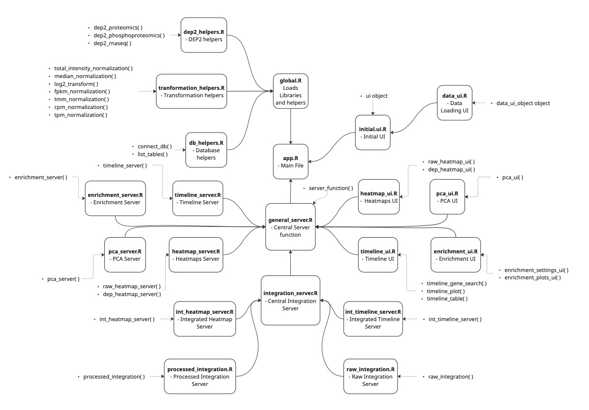

# BRIDGE

## Overview

BRIDGE is a user-friendly app that enables scientists to **explore, analyze and integrate multi-omics datasets** (proteomics, phosphoproteomics and RNA-seq) interactively, privately and without the need of programming skills. It supports both **individual** and **integrative** analysis of datasets and generates interactive visualisations such as heatmaps, volcano plots, and time-course clusters. BRIDGE is especiallt powerful for identifying shared biological signals across different omics layers. 

## Installation

In order to download and start using bridge there are some previous steps to be done, like setting the environment and creating the database.

### Setting up the environment
    
First, the user has to clone the git repository to the local machine.

```bash
git clone git@github.com:dmarquezoller/BRIDGE.git
 ```

After copying the repository the environment has to be set up in R so all the libraries are available.

```R
renv::restore() #This command is to be done inside the project
```

After this, your local computer will have all the files and required libraries

### Database creation

In order to use the app, a database is needed. Scripts are provided for the user to be guided through the process.
Firstly, a `.db` file has to be created.

```bash
touch user_database.db
```
Then, after creating the empty database, it has to be filled with tables and annotation files, for that, two scripts are provided that will guide the user through the process.

Both scripts assume certain homogeneity in the data. For a correct functioining of the scripts and the app, please check the **rules** inside both Python scripts.

```bash
python /BRIDGE/Python/db_adding.py
```

```bash
python /BRIDGE/Python/db_adding_annotation.py
```

Both this scripts can be executed as many times as needed. 

After all this, the user will have the usable database.

## Usage

Now, the user already has all the files and libraries as well as the database, so it only remains the execution of the app.

```bash
Rscript /BRIDGE/app.R user_database.db
```

After the execution the app will be open, copy the `url` to your browser and start using BRIDGE!

## File structure

As said before, the code has been heavily modularized to ease the editing, debugging and improvement of the app.
This also allows the user to furhter locally customize the app with more pipelines or plots without the need of understanding and editing the whole code 
but rather just changing the corresponding files.

Here is a diagram showing all the different code files and their hierarchy. Moreover, you can also see which functions are declared in which files and a brief description of what is inside each file.
Following this diagram, the user should find in a fairly easy manner the part of the code they are interested in.

